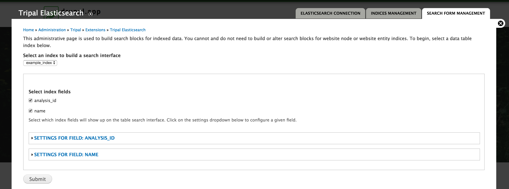
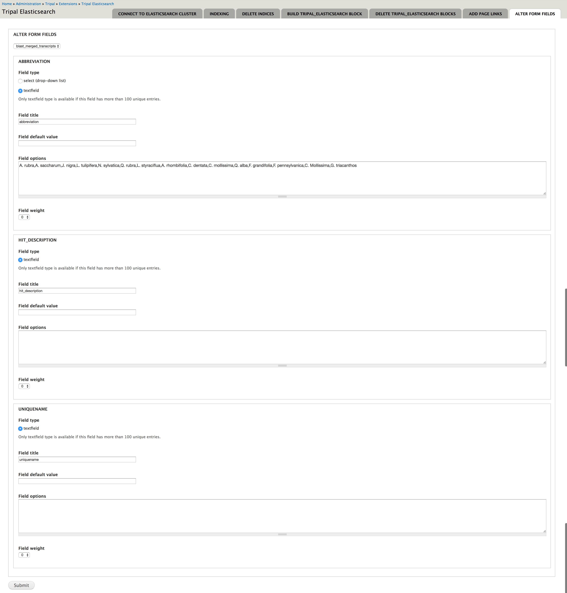

## Install tripal_elasticsearch module

Before you can use this module, you need to set up an elasticsearch cluster on either the same host as your drupal site, or on a different host or cloud. Please refer to [https://www.elastic.co/guide/en/elasticsearch/reference/current/install-elasticsearch.html](https://www.elastic.co/guide/en/elasticsearch/reference/current/install-elasticsearch.html) for setting up elasticsearch.

To install **tripal_elasticsearch**

```
cd drupal_root/sites/all/modules
git clone https://github.com/tripal/tripal_elasticsearch.git
drush en tripal_elasticsearch -y
```

## Connect to your running elasticsearch cluster

You will need the domain name or ip address of your elasticsearch host and the port. By default, the **tripal_elasticsearch** module will automatically connect to the elasticsearch cluster running on your local host with port 9200. You can change this using the admin page:
**admin/tripal/extension/tripal_elasticsearch/connect_to_elasticsearch_cluster**


If the cluster is successfully connected, the cluster health information will display.

## Index the entire website

To index the entire website, you go to **admin/tripal/extension/tripal_elasticsearch/tripal_elasticsearch_indexing** and select *index_website* and then submit. You can select up to 10 cron queues. For website indexing, the published node ids are obtained from the database. Then the corresponding html code is extracted and deparsed to generated strings for indexing. Sequences strings are excluded from indexing since they are meaningless. If you have 1,000,000 published nodes on your website, and you index the website with 5 cron queues, 1,000,000 will be generated and evenly distributed to the 5 cron queues. Then you will be able to set up 5 threads for parallel indexing.


If the index already exists, and you re-index without deleting the existing index, you will generate redundant data for that particular index.

## Index specific database tables

You can also select a table from the database to index. And you can specify which fields from that table you want to index. Below is an example of indexing a joined table which consists of data from chado.feature, chado.organism and chado.blast_hit_data. 


## Parallel indexing with multiple threads

Drupal needs URL request to trigger cron jobs. But you can manually set up cron jobs in your server.

* Edit the crontab file:

```
crontab -e
```

* Add the following jobs to your crontab file (assume that you select 5 cron queues when submitting the indexing form)

```
*/5 * * * * drush cron-run queue_elastic_queue_0 --options=thread=1 --root=/path/to/your/drupal/root
*/5 * * * * drush cron-run queue_elastic_queue_1 --options=thread=2 --root=/path/to/your/drupal/root
*/5 * * * * drush cron-run queue_elastic_queue_2 --options=thread=3 --root=/path/to/your/drupal/root
*/5 * * * * drush cron-run queue_elastic_queue_3 --options=thread=4 --root=/path/to/your/drupal/root
*/5 * * * * drush cron-run queue_elastic_queue_4 --options=thread=5 --root=/path/to/your/drupal/root
```

These will run the cron jobs every 5 minites. 


## Monitoring indexing process

There are several ways that you can check your indexing process goes.

1. Go to **admin/reports/dblog** and select *Tripal elasticsearch: indexing*
2. Go to **admin/config/system/queue-ui** to see the number of remaining items in each queue.
3. Use the command line below in the server that hosts your elasticsearch cluster to display the number of documents in each index.

    ```
    curl elasticsearch_cluster_domain:port/_cat/indices?v
    ## example
    curl localhost:9201/_cat/indices?v
    ```


## Build search block

Once the index is created and has some documents in it, you can build a search block for it. You don't have to wait for the indexing process to be complete. 

Go to **admin/tripal/extension/tripal_elasticsearch/build_tripal_elasticsearch_block** and select a table. After you select a table, you are allowed to select which indexed fields from that table you want to show to website users for searching. 



The search block is in a drupal block and will be displayed on the page *your.drupal.site/elastic_search* by default. You may need to clean the cache to display the block. A paired block will be automatically created to display the search outputs. These are normal drupal blocks and therefore configurable.

Blocks can be deleted through the admin page: **admin/tripal/extension/tripal_elasticsearch/delete_tripal_elasticsearch_blocks**

## Link search results to pages.

The search results can be used to build URLs and link the results to particular pages through the admin page **admin/tripal/extension/tripal_elasticsearch/tripal_elasticsearch_add_links**. For example:

.

All the feature pages have a fixed pattern of URL: *feature/[uniquename]*. The URL only varies on the *[uniquename]* and is a formula of the field values.

## Alter form fields

By default, all generated search blocks use text input box for each field. However, you can change the input box to a dropdown through the admin page **admin/tripal/extension/tripal_elasticsearch/tripal_elasticsearch_alter_form**. You can also change the labels and order of fields.




# tripal_elasticsearch

`tripal_elasticsearch` is a drupal module which integrates the powerful search engine [elasticsearch](https://www.elastic.co/) with drupal sites, providing general site-wide indexing and search, as well as specific indexing and search for any number of drupal and chado tables. It also provides an easy way to build search interface for individual drupal and chado tables after these tables are elastic-indexed.

## The dependencies of `tripal_elasticsearch`
* The module `tripal_elasticsearch` depends on the search engine `elasticsearch`. Please follow [`the download and install directions`](https://www.elastic.co/downloads/elasticsearch) to run this module.
* This module use `elasticsearch-php client` library to interact with `elasticsearch`. The normal elasticsearch install will come with the `elasticsearch-php client` library.

## Install elasticsearch
### Elasticsearch requires php version > 5.3.9

* check your php version: `php -v`

### Download elastic to your drupal site server
```
cd path/to/the/same/level/of/your/drupal/site/root
sudo wget https://download.elastic.co/elasticsearch/elasticsearch/elasticsearch-1.7.1.tar.gz
```

### Extract the files
```
tar -xvf elasticsearch-1.7.1.tar.gz
```

### Change the ownership of elasticsearch directory from `root` to `yourusername`
Elasticsearch doesn't run as root, so change the ownership from `root` to a different user.
```
chown -R username:username elasticsearch-1.7.1
```

### Configure `elasticsearch.yml`

* `cd elasticsearch-1.7.1/config`
* Open the configuration file: `vi elasticsearch.yml`
* Find the line starting with `#network.host:` and add `network.host: localhost` below it
* This is also your opportunity to change where elasticsearch puts the index files, which can be quite large. See the path.data config line.

### Start and stop elasticsearch
* To start: `cd elasticsearch-1.7.1` and `bin/elasticsdearch`
* To stop: `ctrl+c`

### [Run elasticsearch on the backgroud](https://www.elastic.co/guide/en/elasticsearch/reference/current/setup.html)
* `cd elasticsearch-1.7.1`
* `bin/elasticsdearch -d`

## Install `tripal_elasticsearch` module
* Install the module as a custom module: `cd sites/all/modules/custom`
* Download the module `wget https://github.com/tripal/tripal_elasticsearch.git`
* Run drush command to install: `drush en tripal_elasticsearch -y` (If you don't already have dependencies ultimate_cron and queue_ui, this will help you install them as well).

You can also fork the module from github and contribute to development.

__Currently this module has only been extensively tested on the [hardwood genomics database](http://hardwoodgenomics.org). We welcome feedback on any problems you have with using it on other sites.__

The module will enable two default blocks, one is a simple search box, the other is for more detailed queries. If you try to use them, they won't work yet. For them to work, you will need to create the index.

## Site-wide indexing
To implement a site wide search, the `tripal_elasticsearch` module indexes the content of every Drupal node. This includes much of the chado database content if it has been synced to Drupal. However, `tripal_elasticsearch` can also be used to directly index chado tables and thus to build very specific and customizable search interfaces based on the data from those chado tables. For the first example, we'll set up the site wide search.

* Go to __sitename.org/admin/tripal/extension/tripal\_elasticsearch__
* Select __index_website__ from the dropdown table list and then click on the "Index" button

You will see the page is loading. Do not close the page until the loading is finished. A cron queue is being created during this process. This may take one or two minitues depending on how many nodes your website has.


If the website has been indexed (like you see on the picture above), you may delete the index and then re-index it. To delete an index, go to __sitename.org//admin/config/search/elastic_search/delete_tripal_elasticsearch_indices__.

Once the cron queue is built, the site-wide indexing process will be automatically run by the cron jobs that you set up for Drupal. However, this is likely to be very slow. Below is more information on monitoring and speeding this process up.

### Monitor the number of items in the cron queue

Go to __sitename.org/admin/config/system/queue-ui__ to check how many items remaining in your elastic\_search cron queue. When no items left in the elastic\_search cron queue, the site-wide indexing process is finished.


### Run your elastic_search cron queue with multiple threads
With the help of the __ultimate_cron__ module, you can run a cron queue with multiple threads. This will significantly speed up the indexing process.

Go to __sitename.org/admin/config/system/cron/jobs/list/queue_elastic_queue/edit__ and select the number of threads you want to run


You may want to add additional cron jobs to your crontab file to continously trigger these jobs if your website doesn't have frequent requests. Below is an example:

* login to your server
* `crontab -e` to open the crontab file
* Add the command lines below to your crontab file. You may add more lines, depending on how many threads you set up.
```
*/5 * * * * drush cron-run queue_elastic_queue --options=thread=1 --root=path/to/you/drupal/site/root
*/5 * * * * drush cron-run queue_elastic_queue_2 --options=thread=2 --root=path/to/you/drupal/site/root
*/5 * * * * drush cron-run queue_elastic_queue_3 --options=thread=3 --root=path/to/you/drupal/site/root
*/5 * * * * drush cron-run queue_elastic_queue_4 --options=thread=4 --root=path/to/you/drupal/site/root
*/5 * * * * drush cron-run queue_elastic_queue_5 --options=thread=5 --root=path/to/you/drupal/site/root
*/5 * * * * drush cron-run queue_elastic_queue_6 --options=thread=6 --root=path/to/you/drupal/site/root
*/5 * * * * drush cron-run queue_elastic_queue_7 --options=thread=7 --root=path/to/you/drupal/site/root
```


Customized Searching of Specific Database Tables
------------------------------------------------
By indexing specific database tables, new types of searching are enabled:
* select any tables from the drupal public databases or chado databases to index, regardless of whether or how they are synchronized as Drupal nodes
* index joined tables to combine data from different tables (for example, searching for features while filtering on organism)
* select specific fields from indexed tables for searching (for example, customize the feature search by an associated analysis and by keyword from the blast hit descriptions)

Here are the general steps:
* Go to __sitename.org/admin/config/search/elastic_search/tripal_elasticsearch_indexing__
* Select a table from the dropdown
* select fields from the table that you want to index
* click `Index` button


Next, build the search block for the indexed table
* Go to __sitename.org/admin/config/search/elastic_search/build_tripal_elasticsearch_block__
* Select a table from the dropdown. All the tables listed have been successfully indexed
* Select fields that you want to give users searching access
* Click 'Add elastisearch block' button
* Clear cache with drush command `drush cc all` or go to `sitename.org/admin/config/development/performance` and click `Clear all caches` button

All search blocks will be displayed on the `sitename.org/elastic_search` page by default. However, these blocks are configurable and can be moved to any other pages.  


### Example 1: Organism Search:
Building a customized organism search block.
* Go to __sitename.org/admin/config/search/elastic_search/tripal_elasticsearch_indexing__
* Select the organism table from the dropdown
* Select fields from the table that you want to index, such as abbreviation, common name, genus, species
