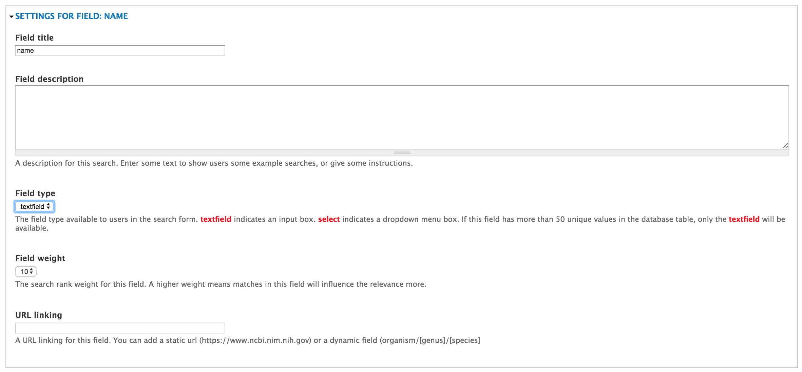

**Previous section:  [Indexing](indexing.md)**

# Notice
Search forms are available only for custom made indices (or indices of type "database"). The default indices (Tripal Entities, Website and Gene Search) have predefined Drupal blocks that can be found at Structure > Blocks or `/admin/structure/block`.

# Building Custom Search Forms
After your database tables get indexed, you can build a search interface for them.  Note that search blocks for node, entities, and genes are configured automatically and cannot be customized.  
You can choose to expose all table fields or a subset of fields for searching.

The admin page for building search blocks is at `http://[your-tripal-site-domain]/admin/tripal/extension/tripal_elasticsearch/forms`.

You can configure the settings for each field in the search block.  Expanding the field's dropdown menu will allow you to change the title, description, field type, weight, and URL link.

## URL links

The URL link region of each field will let you configure URL links for that field. Linked fields can be static `(https://www.ncbi.nim.nih.gov)` or dynamic `(organism/[genus]/[species])`.

## Field types

The field type available to users in the search form. `textfield` indicates a text input box. `select` indicates a dropdown menu box. If this field contains more than 50 unique values in the database table, only the `textfield` will be available.

If you choose a `select` field type, you must provide **key|value** pairs to build the dropdown box.  The keys should be the true values in your database table, and the values can be anything that you want to show to your users. key|value pairs must be placed within brackets.  For example, `[key|value]`.

**Next section: [Cross Site Searching](/docs/cross-site-search.md)**

'**[Return to Handbook Index](README.md)**
